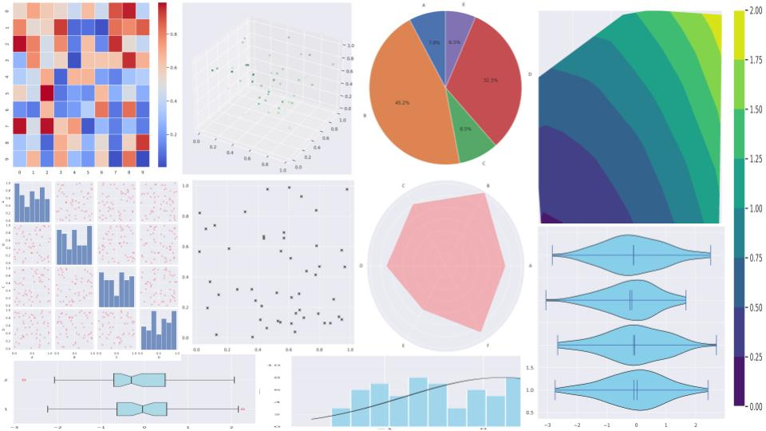

# Unleashing the Power of AI in Data Science: A Deep Dive into OpenAI’s Code Interpreter

This repository contains examples of prompts and responses with OpenAI's Code Interpreter, as showcased in the Medium article [Unleashing the Power of AI in Data Science: A Deep Dive into OpenAI’s Code Interpreter](https://medium.com/@adri.perse/unleashing-the-power-of-ai-in-data-science-a-deep-dive-into-openais-code-interpreter-edbac26decda).

## Table of Contents
1. [Introduction](#introduction)
2. [Examples](#examples)
3. [Data](#data)
4. [Discussion](#discussion)

## Introduction
In the rapidly evolving landscape of artificial intelligence (AI), OpenAI’s Code Interpreter has emerged as a revolutionary tool. This repository explores the technical aspects of Code Interpreter, illustrating its capabilities with real-world examples and exploring its implications for the future of data science.

## Examples
This section contains examples of prompts and responses with OpenAI's Code Interpreter. Each example is provided as an IPython notebook:

- [Matrix GIF Notebook](Matrix_Gif.ipynb)
- [Video GIF Notebook](Video_gif.ipynb)
- [More examples...](link-to-more-examples)

## Data
All input and output data used in the examples are stored in the [Data](data) folder.

## Discussion
Do you believe AI will significantly shape the future of data science? Have you used the Code Interpreter, and what were your results? Please share your experiences and opinions in the comments below. Let’s start a conversation about the exciting intersection of AI and data science.
